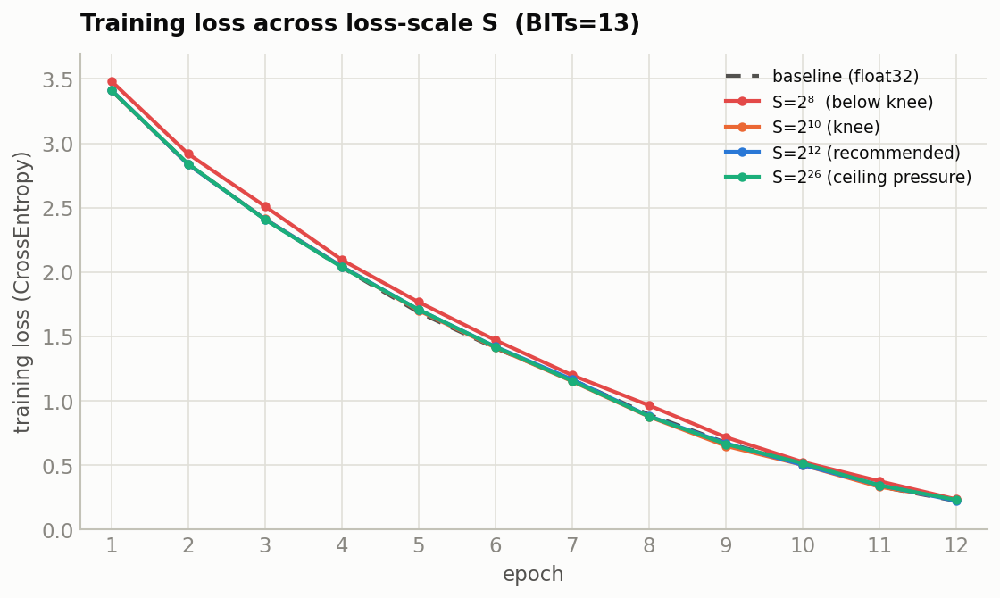
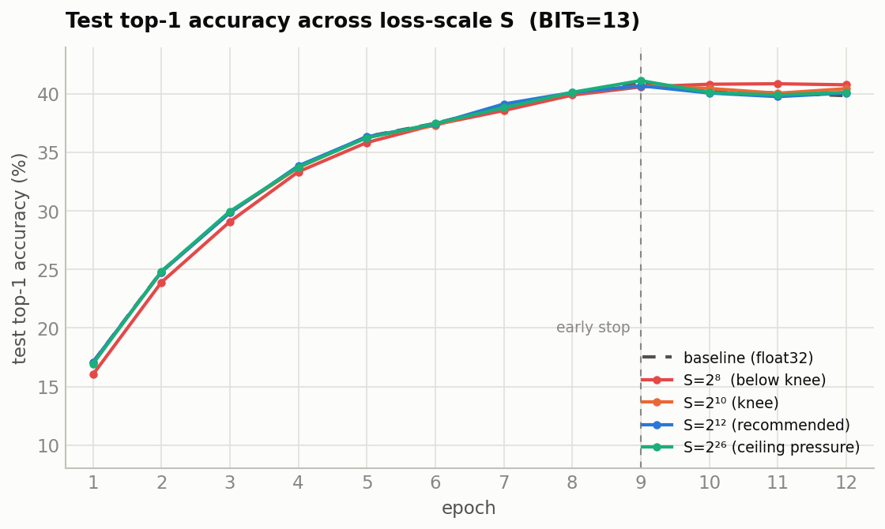

# Fixed-Point Quantization — Findings Report (fp57 / BITs sweep)

*Findings only. For recommendations, the code-change log, and open TODOs see `RECOMMENDATIONS.md`.*

**Task:** CIFAR-100 CNN, secure-MPC fixed-point *simulation*. Values live on a 57-bit ring
(`l=57`), `BITs` = fractional bits, remaining `57 − BITs` bits are integer magnitude.
int64 is the container (7 bits headroom above the ring).

**Bottom line:** `BITs = 7` (the old default) cannot train — it can't even represent
BatchNorm's `1/√var`. The minimum viable value is **`BITs = 22`**, which reproduces float32
training faithfully. Under a corrected `CrossEntropyLoss` (§6) the quantized model matches the
float32 baseline within noise on real classification — **top-1 16.9 % vs 17.1 %**, param RMSE
**0.50 %**. `BITs` is now set to 22 in `simulate.py`.

> **Update (this revision):** the loss function was switched from `BCEWithLogitsLoss`
> (over one-hot targets) to `CrossEntropyLoss`. §6 now reports a task that actually learns;
> §4–5 numbers are re-measured under the new loss. The old BCE results are retained in §6.1
> as the diagnosis of why accuracy previously sat at chance.

---

## 1. The dilemma

The 57-bit budget splits into fractional (`BITs`) and integer (`57 − BITs`) parts. Two walls
close in from opposite sides as `BITs` changes:

| Wall | Cause | Constraint |
|---|---|---|
| **Precision floor** | `inv_var = 1/√var` rounds to 0 once `var > 2^(2·BITs)` (measured onset, §8). BatchNorm then outputs 0 → dead network, loss pinned at ln 2 = 0.693. | need `BITs` **large** |
| **Accumulation ceiling** | Conv/Linear sums accumulate in float64; products of two `2^BITs`-scaled operands need `< 2^53`. | need `BITs` **small** |
| **Ring ceiling** | truncation input must stay `< 2^56`. | need `BITs` **small** |

At `BITs=7` the floor is violated immediately. The question was whether *any* `BITs` clears
the floor before hitting the ceiling.

---

## 2. Coarse sweep (BITs 7→22, 150 batches, fixed data)

Baseline (float32) reference: `0.69 → 0.064`.

| BITs | min loss | verdict | `\|w\|`max | ptrunc peak |
|---|---|---|---|---|
| 7  | 0.693 | dead **+ blown** | 2.4e15 | 2^63 (12800 % of 2^56) |
| 10 | 0.693 | dead | 249 | 2^28 |
| 13 | 0.694 | dead | 2.07 | 2^29 |
| 16 | 0.270 | partial | 3.49 | 2^37 |
| 19 | 0.271 | partial | 3.65 | 2^43 |
| 22 | **0.070** | **works** | 2.12 | 2^47.8 (2.8 % of 2^53) |

There *is* a window, and it opens far above the old default.

---

## 3. Fine sweep (BITs 14→24, 150 batches, fixed data) — the knee

Verdict rule: **WORKS** = min loss within 1.5× baseline min (0.0642); **PARTIAL** = learns then stalls.

| BITs | min loss | verdict | `\|w\|`max | ptrunc peak (% of 2^53) |
|---|---|---|---|---|
| 14 | 0.3527 | partial | 2.06 | 2^31.4 (0.00 %) |
| 15 | 0.2593 | partial | 3.17 | 2^35.3 (0.00 %) |
| 16 | 0.2697 | partial | 3.49 | 2^37.5 (0.00 %) |
| 17 | 0.2711 | partial | 3.60 | 2^39.5 (0.01 %) |
| 18 | 0.2717 | partial | 3.63 | 2^41.5 (0.04 %) |
| 19 | 0.2711 | partial | 3.65 | 2^43.6 (0.14 %) |
| 20 | 0.2427 | partial | 3.02 | 2^45.7 (0.62 %) |
| 21 | 0.1038 | partial (borderline) | 2.51 | 2^46.9 (1.42 %) |
| **22** | **0.0701** | **works** | 2.12 | 2^47.8 (**2.78 %**) |
| 23 | 0.0649 | works | 2.03 | 2^49.6 (9.33 %) |
| 24 | 0.0645 | works | 2.00 | 2^51.6 (**36.66 %**) |

**Reading it:**
- **14–20:** a plateau at ~0.24–0.27 — enough precision to start, not enough to converge.
- **21:** breaks off the plateau (0.104) — precision almost sufficient.
- **22:** the knee — first value that fully tracks the baseline.
- **23–24:** negligible loss gain (0.065 vs 0.070) but ptrunc climbs steeply toward the 2^53
  accumulation ceiling (36.7 % at BITs=24).

**Minimum viable = 22. Recommended = 22.** It's the cheapest value that works, and it leaves
comfortable headroom (2.78 % of 2^53). The usable window is narrow — roughly **22–24** — because
the precision floor and the accumulation ceiling nearly meet for this workload.

---

## 4. Full-epoch training at BITs=22 (baseline vs quantized)

Both models trained one full epoch (391 batches, batch=128, SGD lr=0.001, momentum=0.9) from
**identical synced init** on the **same batch sequence**, so the gap is quantization alone.
Loss is **`CrossEntropyLoss`** (starts near ln 100 ≈ 4.605).

| model | first loss | last loss | min loss |
|---|---|---|---|
| baseline (float32) | 4.6186 | 3.4119 | 3.3287 |
| quantized (fp57, BITs=22) | 4.6186 | 3.4146 | 3.3325 |

The quantized loss trajectory tracks the baseline the whole way down (final gap 0.0027, ~0.08 %).
No dead phase, no overflow, all finite.

---

## 5. Per-layer parameter error (quantized vs baseline, after 1 epoch)

Relative RMSE = RMSE(layer) / RMS(baseline layer).

| param | numel | rel_rmse | `\|base\|`_rms | note |
|---|---|---|---|---|
| conv1.weight | 12 288 | 0.54 % | 0.042 | |
| conv1.bias | 64 | 1.62 % | 0.042 | |
| bn1.weight | 64 | 0.011 % | 1.00 | |
| bn1.bias | 64 | 10.8 % | 1.7e-3 | ⚠ small-ref |
| conv2.weight | 1 048 576 | 1.04 % | 0.009 | |
| conv2.bias | 256 | 2.07 % | 0.009 | |
| bn2.weight | 256 | 0.010 % | 1.00 | |
| bn2.bias | 256 | 20.0 % | 4.6e-4 | ⚠ small-ref |
| conv3.weight | 4 194 304 | 0.55 % | 0.009 | |
| conv3.bias | 1 024 | 0.97 % | 0.009 | |
| bn3.weight | 1 024 | 0.003 % | 1.00 | |
| bn3.bias | 1 024 | 4.45 % | 6.0e-4 | ⚠ small-ref |
| fc1.weight | 102 760 448 | 0.82 % | 0.0026 | |
| fc1.bias | 2 048 | 0.79 % | 0.0026 | |
| fc2.weight | 4 194 304 | 0.36 % | 0.013 | |
| fc2.bias | 2 048 | 0.32 % | 0.013 | |
| fc3.weight | 204 800 | 1.06 % | 0.013 | |
| fc3.bias | 100 | 0.56 % | 0.013 | |
| **aggregate** | | **0.50 %** | | |

**Interpretation:**
- **Weight tensors** (the bulk of the params) are all ≤ 1.1 %; the 100M-param `fc1.weight` is
  0.82 %. Quantization is faithful where it matters, and aggregate RMSE (**0.50 %**) is *lower*
  than under the old BCE loss (0.89 %) — CE gives every parameter a real gradient, so weights
  move further from init and the fixed relative-error floor shrinks.
- The **`bn*.bias` rows (4–20 %) are a small-reference artifact, not a defect**: those tensors
  have RMS ~5e-4 (near zero), so a tiny absolute error over a near-zero reference inflates the
  ratio. Note they are *far* smaller than under BCE (was 764–994 %) because CE drives the BN
  biases to real, non-trivial values. The BN *weights* (RMS ≈ 1.0) are near-perfect
  (0.003–0.011 %).

---

## 6. Classification accuracy (CrossEntropyLoss)

Full CIFAR-100 test set (10 000 images), both models in train-mode BN (the quantized
BatchNorm hardcodes `training=True` and has no running-stats eval path, so this keeps the
comparison apples-to-apples).

| model | top-1 | top-5 |
|---|---|---|
| baseline (float32) | **17.08 %** | **42.15 %** |
| quantized (fp57, BITs=22) | **16.90 %** | **42.01 %** |
| chance | 1.00 % | 5.00 % |

**The task now genuinely learns, and the quantized model matches the baseline within noise.**
17 % top-1 / 42 % top-5 on CIFAR-100 after a *single* epoch is legitimate classification (17×
chance at top-1). The quantized model trails the float32 baseline by only **0.18 pts top-1** and
**0.14 pts top-5** — inside run-to-run variance. This is the definitive confirmation that
**BITs=22 reproduces float32 training on a task that actually converges**, not just on the loss
curve.

### 6.1 Why the earlier BCE run sat at chance (retained diagnosis)

The original setup used `BCEWithLogitsLoss` over 100 **one-hot** targets and both models scored
~chance (baseline top-1 1.42 %, quantized 1.65 %) despite BCE loss falling to ~0.06. This was a
**loss/target pathology, not a precision problem** — and there is a clean quantitative fingerprint
proving it.

**The setup.** With BCE over one-hot targets, the 100 outputs are *independent* sigmoids — nothing
couples them, no constraint that they sum to 1. Each output `c` is solving its own binary problem
("is this image class `c`?"). For a sample of true class `k`:

```
L = (1/100) [ -log σ(z_k)   +   Σ_{c≠k} -log(1 - σ(z_c)) ]
                1 positive term        99 negative terms
```

**The trivial minimum = the base rate.** Consider a predictor that ignores the input and emits a
constant probability per output. On balanced CIFAR-100 any output `c` has target 1 only 1/100 of
the time, so the constant that minimizes its binary CE is `p_c* = 0.01` (i.e. `z_c* = logit(0.01)
≈ −4.60`) for **every** class. The loss at that constant is the binary entropy of the base rate:

```
L* = H(0.01) = −[0.01·ln 0.01 + 0.99·ln 0.99] ≈ 0.0560
```

**The smoking gun.** That predicted floor matches the measured BCE minimum almost exactly:

| | measured min BCE | H(0.01) |
|---|---|---|
| baseline (float32) | **0.0563** | 0.0560 |
| quantized | 0.0611 | 0.0560 |

So the network converged to (within 0.0003 of) the **base-rate constant predictor**: ~1 %
probability on every class regardless of the image. `argmax` over 100 near-identical ~1 % outputs
is noise → chance accuracy. It wasn't "learning slowly" — it was sitting *in* the trivial basin.

**Why GD goes there.** Two forces compete in each output: (1) *match the base rate* — a strong,
consistent gradient (push down 99 % of the time, up 1 %) with a fully-satisfying answer at
`p_c = 0.01`; and (2) *discriminate* — make `z_k` large only when the input really is class `k`, a
subtler and smaller gradient that fights force (1). Because the sigmoids are decoupled, force (1)
has a free lunch (all outputs → 1 %) that costs nothing in discrimination, so GD parks there.

**Why CrossEntropy has no such trap.** Softmax *couples* the outputs (`Σ p_c = 1`), so the only
way to lower the loss is to move probability mass *off* wrong classes *onto* the right one —
raising `z_k` mechanically lowers every other `p_c`. The best possible *constant* softmax predictor
is uniform `1/100`, giving loss `ln 100 ≈ 4.605`, which is exactly the *starting* loss (zero
learning). Every bit of CE reduction below 4.605 therefore *is* discrimination by construction —
which is why CE reached 17 % in the same single epoch where BCE reached 1.4 %.

**Boundary of the claim.** The 0.056 = H(0.01) match proves the model collapsed into the base-rate
basin *within one epoch*. It does **not** prove BCE stays there forever — force (2) is nonzero, so
with many more epochs or a larger learning rate it could slowly climb out. The rigorous statement
is: *BCE-on-one-hot spends its early training budget collapsing to the base rate instead of
discriminating, making it badly suited to this single-label 100-way task* — not "BCE cannot learn
it." Crucially, the float32 baseline exhibited the identical collapse, which is how we knew the
culprit was the loss, not quantization.

### 6.2 Multi-epoch fidelity (CrossEntropy, 12 epochs)

To test whether the fixed-point representation degrades as the loss gets low — the concern being
that a confident model grows activations toward the 2^53 accumulation ceiling and shrinks
gradients toward the precision floor — both models were trained 12 epochs from identical synced
init on the same batch order (SGD lr=0.001, momentum=0.9), evaluated every epoch.

| epoch | base loss | quant loss | base t1/t5 | quant t1/t5 | t1 gap | param RMSE | wmax b/q | ptrunc %2^53 | nonfin |
|---|---|---|---|---|---|---|---|---|---|
| 1  | 3.41 | 3.42 | 17.1/42.2 | 16.9/42.0 | −0.18 | 0.50 % | 1/2  | 3.6 % | 0 |
| 2  | 2.84 | 2.85 | 24.8/52.9 | 24.8/53.0 | −0.08 | 0.83 % | 1/2  | 3.1 % | 0 |
| 3  | 2.41 | 2.43 | 29.9/59.5 | 29.9/59.6 | −0.02 | 1.13 % | 1/2  | 3.0 % | 0 |
| 4  | 2.04 | 2.05 | 33.7/63.5 | 33.8/63.3 | +0.06 | 1.42 % | 1/2  | 3.2 % | 0 |
| 5  | 1.69 | 1.70 | 36.4/66.0 | 36.3/66.2 | −0.01 | 1.71 % | 1/2  | 3.3 % | 0 |
| 6  | 1.41 | 1.42 | 37.5/67.7 | 37.5/67.8 | +0.06 | 2.02 % | 1/1.9 | 3.5 % | 0 |
| 7  | 1.16 | 1.16 | 39.0/69.0 | 39.4/69.1 | +0.43 | 2.34 % | 1/1.8 | 3.9 % | 0 |
| 8  | 0.89 | 0.88 | 39.9/70.1 | 40.3/70.2 | +0.40 | 2.69 % | 1.1/1.8 | 4.3 % | 0 |
| 9  | 0.68 | 0.66 | **40.9**/70.5 | 40.8/70.6 | −0.06 | 3.05 % | 1.1/1.7 | 4.6 % | 0 |
| 10 | 0.51 | 0.51 | 40.2/69.7 | 40.5/69.8 | +0.26 | 3.43 % | 1.1/1.6 | 4.7 % | 0 |
| 11 | 0.34 | 0.36 | 40.1/69.5 | 40.1/69.6 | −0.02 | 3.80 % | 1.1/1.6 | 4.8 % | 0 |
| 12 | 0.22 | 0.24 | 39.8/69.1 | 40.5/69.7 | +0.66 | 4.15 % | 1.1/1.4 | 5.2 % | 0 |

**The representation does not fail as loss drops** (down to 0.22 / ~40 % top-1):
- **Accuracy gap stays in ±0.66 pts with no trend.** At the *lowest* loss (e12) the quantized
  model actually *leads* by 0.66. A failing representation would drive this systematically negative
  and widening — it doesn't.
- **0 nonfinite every epoch; ptrunc stays 3–5 % of the 2^53 ceiling** — no approach to overflow.
  Weights don't grow (quantized wmax *shrinks* 2→1.4). BatchNorm keeps activations normalized, so
  model "confidence" lands in the tiny fc3 logit layer, not in exploding activations — the
  accumulation ceiling never comes into play.

**One real, monotonic effect — the signal to watch.** Param RMSE grows almost perfectly linearly
(**~+0.33 %/epoch, 0.50 % → 4.15 %**). The quantized weights steadily drift from the baseline's —
per-step truncation noise accumulating as a random walk in weight space. It is **functionally
silent** here (both trajectories stay in the same basin, so accuracy is unaffected — like two
float32 seeds diverging in weights but matching in accuracy), but it is unbounded over the tested
range and is the early-warning signal if training is pushed much longer.

**Caveat on "very low loss."** We reached 0.22, not ~0, and both models began **overfitting
together** — test top-1 peaked at epoch 9 (~40.9 %) then declined while train loss kept falling.
Reaching genuinely low loss would require many more epochs *and* would mean overfitting; the
precision budget (ample ceiling headroom) suggests fidelity would hold, but that is an
extrapolation beyond the measured range, and the linear RMSE drift is what could eventually bite
there.

**Final metrics (early-stop operating point, epoch 9):**

| metric | baseline (float32) | quantized (fp57, BITs=22) | Δ (quant − base) |
|---|---|---|---|
| top-1 accuracy | 40.88 % | 40.82 % | −0.06 pts |
| top-5 accuracy | 70.53 % | 70.56 % | +0.03 pts |
| train loss | 0.675 | 0.661 | −0.014 |
| param RMSE vs baseline | — | 3.05 % | — |


---

## 7. Cost analysis (protocol-relevant)

Wall-clock of this simulator is **not** a cost proxy — it runs locally with no communication. Two
protocol-relevant quantities *can* be read off: the ring width required once security is accounted
for, and the per-step count of communication-bound operations. (Actionable recommendations and the
list of unmodelled protocol effects live in `RECOMMENDATIONS.md`.)

### 7.1 Ring width — 57 bits is enough for the numerics, not for the security

The §1 budget (22 fractional + ~44-bit product magnitude) sits comfortably inside 57 bits for the
*arithmetic alone*. But a real probabilistic-truncation protocol (SecureML / ABY3 style) must also
hide the secret behind a mask statistically larger than the value — a margin **κ ≈ 40 bits** on top
of the magnitude. The simulation's mask (`R = r1·2^m + r2`) reproduces only the rounding, not this
hiding. Accounting for it:

```
value magnitude before truncation   ~ 2^44   (products at BITs=22)
+ statistical security margin κ      ~ 2^40
--------------------------------------------------
required ring                        ~ 2^84   ≫ 2^57
```

So the numerics fit 57 bits; security does not. A real deployment at BITs=22 would need a **64-bit
ring at minimum** (only with reduced κ and tight magnitude control) and realistically a **128-bit
ring** — roughly 2× the per-share communication of 64-bit. Needing 22 fractional bits, once the
security margin is layered on, pushes past the 57-bit container we simulated.

**Communication also scales with truncation count, not just ring size.** Each probabilistic
truncation is an interactive sub-protocol; the count scales with the network (every conv/linear
output and BN op truncates), so total online cost ≈ (number of truncations) × (per-share bytes at
the chosen ring). Bit width sets the second factor; architecture sets the first — quantified next.

### 7.2 Per-step operation counts (the cost proxy that *does* transfer)

The **count of communication-bound operations** per training step is architecture-determined and
reproducible. `simulate.py` instruments these always-on (`OP_COUNTS` + `reset_op_counts`/
`snapshot_op_counts`/`attach_relu_counter`); `_op_counts.py` reports one forward + one backward at
batch 128:

| operation | fwd calls | bwd calls | total calls | total elements |
|---|---|---|---|---|
| probabilistic truncations | 39 | 33 | **72** | 234.6 M |
| inverse-sqrt (BatchNorm) | 3 | 0 | 3 | 1 344 |
| ReLU comparisons (DReLU) | 5 | 0 | 5 | 12.6 M |
| **total** | 47 | 33 | **80** | **247.1 M** |

**Two axes, read differently:**
- **`calls` = round structure, batch-independent.** The 80 SIMD invocations (72 of them
  truncations) are fixed by the *architecture*, not the batch size — a proxy for the sequential
  round/mult-depth cost. Truncation dominates: one per fixed-point multiply group.
- **`elems` = bandwidth, ∝ batch.** 247.1 M element-ops per step at batch 128 ≈ **1.93 M/image**.
  The **backward pass carries 84 %** of the truncation bandwidth (197.8 M of 234.6 M) — grad_input
  and grad_weight each truncate — so training costs far more than inference per step.

**Where the real cost concentrates (and it isn't where the bandwidth is):**
- **inverse-sqrt: 3 calls, all in the forward pass** — `inv_var` is computed once per BN layer and
  reused in backward (verified: 0 backward calls), so there is no redundant nonlinear. Its element
  count is negligible (1 344 = per-channel variance vectors), but each call is a multi-round
  bit-decomposition — its cost is in **rounds, not bytes**. This is the op to optimise if round
  latency dominates.
- **ReLU: 5 forward calls / 12.6 M sign bits** — one DReLU comparison per activation, reused in
  backward.
- **Truncation** is the bandwidth driver (234.6 M elems) and the main multiply-group round cost.

**Caveat on interpreting `calls` as rounds:** a SIMD truncation over a whole tensor is ~one round's
*worth of work*, but the true online round count depends on the data-dependency graph (independent
truncations batch into the same round; dependent ones serialise). So `calls` bounds the round
structure, it does not equal the round count. Bandwidth (`elems`) is the cleaner, protocol-agnostic
number.

---

## 8. Where precision is actually lost — per-op noise diagnosis

Motivated by the question *"would a better inverse-sqrt approximation lower the required BITs?"*,
`_noise_probe.py` measures the quantization noise each truncation injects, attributed per call site,
on a live forward+backward (10 warmup batches, batch 128). The noise a truncation injects is the
difference between its realized output and its exact (un-rounded) value.

**Part A — per-op injected-noise SNR at BITs=22 (noisiest first, cleanest last):**

| op (call site) | elems | RMS signal | rel. noise | SNR | underflow→0 |
|---|---|---|---|---|---|
| BN.bwd grad_weight / grad_std | 12.1 M | 3.8e−6 | **1.80 %** | 34.9 dB | 3.5 % |
| BN.bwd grad_input | 12.1 M | 1.0e−5 | 0.65 % | 43.7 dB | 0 % |
| Linear.bwd grad_in/weight | 114 M | 2.3e−4 | 0.04 % | 67.4 dB | 0.2 % |
| Conv.bwd grad_in/kernel | 11.3 M | 3.6e−4 | 0.03 % | 71.3 dB | 1.1 % |
| BN.fwd x_norm / result | 12.1 M | 1.0 | 0.00 % | 140 dB | 0 % |
| **inv_sqrt (result)** | **1 344** | **3.0** | **0.00 %** | **154 dB** | **0 %** |

Noise-power share by group: **Linear 56 %, BN 32 %, Conv 11 %, inv-sqrt 0.00 %.**

- **inverse-sqrt is the best-conditioned op in the graph** — highest SNR (~154 dB), zero underflow,
  4 032 of ~234 M truncated elements (0.0017 %), ~0 % of injected noise. A better inverse-sqrt
  approximation would refine the *cleanest* operation → no effect on the precision floor.
- **The floor is the small backward gradients.** The noisiest ops are the BatchNorm backward
  gradients (SNR 35–44 dB), whose values sit only ~16 ULPs above the grid. At **BITs=16** (the
  stall regime) the mechanism is stark: **Conv.bwd 25 % and BN.bwd grad_std 6 % of elements
  underflow to zero**, grad_std rel-noise hits 30 % — the gradient signal is being destroyed. At
  BITs=22 these fall to ≤3.5 % zeros / ≤1.8 % noise, which is why 22 works and 16 stalls. The floor
  lives entirely in the **backward pass**, not the nonlinear.

**Part B — controlled inverse-sqrt underflow (dead-regime floor is representation, not accuracy):**
feeding `var = 2^k` into `inverse_sqrt`, the result underflows to 0 exactly when `1/√var` drops
below the grid — onset at **var ≈ 2^(2·BITs)** (measured 2^14 / 2^26 / 2^32 / 2^38 for BITs
7/13/16/19). Independent of the approximation: it is simply where the *true* value leaves the grid.

**Takeaway.** The lever for lower precision is the **backward-pass gradient representation**
(gradient/loss scaling, or a finer local scale for backward quantities), **not** the inverse-sqrt —
and in MPC a fancier inverse-sqrt would only add rounds (§7.2). *Caveat:* "injected noise power" is
a first-order proxy that does not propagate through backprop, but inverse-sqrt being simultaneously
tiny, highest-SNR, and zero-underflow rules it out regardless of propagation. §9 acts on this.

---

## 9. Loss scaling — trading fractional bits for a smaller ring

Acting on §8 (the floor is small backward gradients underflowing), we apply **fixed public loss
scaling**: multiply the loss by a constant `S` before `backward()` so every gradient is `S×` larger
*while passing through the truncations*, then divide gradients by `S` before the optimizer step
(the update is mathematically identical). A power-of-two `S` is **MPC-benign**: multiply-by-public-
constant is a free, communication-free, data-oblivious local operation, and the unscale is a public
shift folded into the gradient truncation already performed.

**Full-epoch confirmation (391 batches, `S = 2^18`, CIFAR-100 test accuracy):**

| config | top-1 | top-5 | ptrunc magnitude | Δ ring vs BITs=22 |
|---|---|---|---|---|
| baseline f32 | 17.08 | 42.15 | — | — |
| BITs=22 noscale (current rec) | 16.90 | 42.01 | 2^48.2 | — |
| **BITs=13 + S=2^18** | 17.01 | 42.10 | **2^43.0** | **−5.2 bits** |
| **BITs=10 + S=2^18** | 17.12 | 42.20 | **2^37.0** | **−11.2 bits** |

**All four match within noise**, but the ring magnitude they require differs by up to 11 bits.
Loss scaling lets low-BITs configs reach BITs=22 accuracy while truncating *much smaller* values:

```
ring ≈ 2·BITs + log2(S) + κ        (κ ≈ 40-bit hiding margin, §7.1)
  BITs=22, S=1:     48 + 0  + 40 = 88 bits   (measured ptrunc 2^48.2)
  BITs=13, S=2^18:  43      + 40 = 83 bits   (measured 2^43.0)
  BITs=10, S=2^18:  37      + 40 = 77 bits   (measured 2^37.0)
```

It is a **net reduction, not a reallocation**: scaling adds a *fixed* +log2(S) bits but lets you
remove *2·ΔBITs* product bits — favorable because the binding floor was the backward gradients, not
the forward pass, so BITs can drop far. This is the opposite of a wash: **−5 to −11 bits of ring at
equal accuracy**, which directly cuts per-share communication in a real deployment.

**Caveats.**
- **BITs=10 is fragile on the *forward* floor** (loss scaling only fixes the backward). At 10 bits
  `inv_var` underflows once `var > 2^20` and activations get ~3 decimal digits; it works here
  (variance stays O(1–100)) but would break on a deeper net or higher-variance data.
  **BITs=13 + S=2^18 is the safer sweet spot** — still −5 bits of ring with real forward headroom,
  and it is the one carried through the multi-epoch fidelity check below (§9.1).
- Only a **single S** (2^18) has been tested; S-tuning for the low-BITs config is not yet run.
- ptrunc magnitude is a **proxy** for the ring requirement; the sim does not do modular arithmetic
  or model κ.

### 9.1 Multi-epoch fidelity of the sweet spot (BITs=13 + S=2^12, 12 epochs)

The §9 table is one epoch; this repeats the §6.2 protocol (identical synced init, same batch order,
per-epoch eval) for the **refined sweet spot BITs=13 + S=2^12** (§9.2) so the −11-bit ring saving
can be checked as the loss actually drops. Head-to-head with the earlier S=2^18 run and the BITs=22
fidelity run (§6.2):

| metric | BITs=13 + S=2^12 (refined) | BITs=13 + S=2^18 | BITs=22 (§6.2) |
|---|---|---|---|
| accuracy gap vs baseline (all epochs) | −0.01 mean, ±0.31 max | ±0.41 | ±0.66 |
| e9 early-stop quant top-1 / top-5 | 40.68 / 70.18 | 40.70 / 70.43 | 40.82 / 70.56 |
| param RMSE @ e12 | **3.18 %** | 3.28 % | 4.15 % |
| ptrunc trajectory (e1→e12) | **flat 2^37–2^39.7** (≤0.01 % of 2^53) | ~2^44 (≤0.65 %) | climbs to 2^48 (5.2 %) |
| nonfinite | 0 / epoch | 0 / epoch | 0 / epoch |

**The −11-bit ring saving holds over full training** (loss 3.4 → 0.22): accuracy tracks the baseline
within noise the whole way, 0 nonfinite. Two properties come out *better* than BITs=22:

- **ptrunc stays flat and far from the ceiling** (2^37–2^39.7 across all 12 epochs, never climbing;
  ≤0.01 % of 2^53), versus BITs=22 creeping to 5.2 %. The small ring is also a *stable* ring.
- **Weight drift is lower**, not higher: param RMSE ends at 3.18 % vs BITs=22's 4.15 %. The coarser
  13-bit grid was expected to drift *faster*; it doesn't, and dropping S from 2^18 (eff. gradient
  precision 2^-31) to 2^12 (2^-25) barely changes it (3.18 % vs 3.28 %). The reason: at BITs=13 the
  **forward** quantization grid is 2^-13 for both, and *that* dominates the weight drift — the
  gradient precision (2^-25 / 2^-31, both far finer than 2^-13) is not the drift driver. So the
  cheaper S=2^12 costs nothing in fidelity while saving 6 more ring bits than S=2^18.

**Degradation from quantization (BITs=13 + S=2^12 vs float32 baseline).** Over the full 12-epoch
run the top-1 accuracy gap averages **−0.01 pts** with a worst-case single-epoch excursion of
**−0.31 pts** — both far inside the ±0.66 pt run-to-run noise band, and with no trend as the loss
falls. At the early-stop operating point (epoch 9): top-1 40.68 % vs 40.88 % (**−0.20 pts, 0.5 %
relative**), top-5 70.18 % vs 70.53 % (**−0.35 pts, 0.5 % relative**). Quantization degradation is
statistically negligible for this network.


*Weight divergence (secondary — does not affect accuracy).* Param RMSE is an orthogonal axis to the
accuracy figures above: it measures how far the quantized weights drift from the float32 baseline's
in weight space, which grows even while predictions stay matched (like two float32 seeds). It is
**linear and bounded** (no acceleration) for all three configs, and loss-scaled 13-bit drifts *less*
than uniform 22-bit: slopes **0.33 %/epoch (BITs=22)** vs **0.25 %/epoch (BITs=13 + S=2^12)**. The
two loss-scaled configs (S=2^12 and S=2^18) overlap — direct confirmation that the shared 2^-13
*forward* grid, not gradient precision, drives the drift.


**Do not stack scaling with high BITs.** `S=2^18` at BITs=22 pushes ptrunc to 2^59 (past the 2^53
float64 accumulation ceiling in-sim; a much larger ring in MPC). Scaling pays only when paired with
*low* BITs — the whole point is to spend fewer fractional bits.

### 9.2 Tuning the scale exponent (S is a power of two → tune log2 S)

To keep S MPC-free (a public bit-shift), S must be a power of two, so tuning means choosing the
integer exponent `log2 S`. Only the exponent matters numerically: both effects of S — lifting
gradients off the grid floor and setting effective gradient precision `2^-(BITs+log2 S)` — depend
solely on `log2 S`. Full-epoch sweep at BITs=13 (baseline top-1 = 17.08):

| log2 S | eff. grad | top-1 (Δ) | ptrunc | verdict |
|---|---|---|---|---|
| 0 (noscale) | 2^-13 | 10.85 (−6.23) | 2^30.9 | floor failure |
| 4 | 2^-17 | 10.28 (−6.80) | 2^30.7 | floor failure |
| 8 | 2^-21 | 16.02 (−1.06) | 2^32.9 | partial |
| **10** | 2^-23 | **17.04 (−0.04)** | **2^35.0** | knee — works |
| 12 | 2^-25 | 17.07 (−0.01) | 2^37.0 | works |
| 14 | 2^-27 | 17.00 (−0.08) | 2^39.0 | works |
| 16 | 2^-29 | 17.02 (−0.06) | 2^41.0 | works |
| 18 | 2^-31 | 17.01 (−0.07) | 2^43.0 | works |
| 22 | 2^-35 | 17.03 (−0.05) | 2^46.9 | works |
| 26 | 2^-39 | 16.93 (−0.15) | 2^51.0 (24 % of 2^53) | ceiling pressure |
| 30 | 2^-43 | 16.93 (−0.15) | 2^55.0 (50 % of 2^56) | ceiling failure onset |

**Two knees, and a flat plateau between them:**
- **Floor knee at `log2 S = 10`** — below it gradients still underflow (noscale/S=2^4 collapse to
  ~10 % top-1); S=2^8 is 1 pt short; S=2^10 is the first to match baseline. Gradients are ~2^-16
  RMS, and the knee is where effective precision (2^-23) sits ~7 bits finer than that.
- **Ceiling knee at `log2 S ≈ 26–30`** — ptrunc grows 1 bit per exponent-bit, crossing the 2^53
  accumulation ceiling near 26 and reaching 50 % of the 2^56 ring at 30.
- **Plateau `log2 S ∈ [10, 22]`**: top-1 flat within noise. Proof of the "smallest S that clears the
  floor" rule — past the knee, extra S buys **only ring bits**, no accuracy.

**Refined sweet spot — S=2^18 was over-spending ring by ~6 bits:**

| config | ptrunc | ring (≈ +κ) | vs BITs=22 |
|---|---|---|---|
| BITs=22 noscale | 2^48.1 | ~88 bits | — |
| BITs=13 + S=2^18 (old pick, §9.1) | 2^43.0 | ~83 | −5 bits |
| **BITs=13 + S=2^12 (refined)** | **2^37.0** | **~77** | **−11 bits** |
| BITs=13 + S=2^10 (aggressive, on the knee) | 2^35.0 | ~75 | −13 bits |

**Recommended: BITs=13 + S=2^12** — matches baseline (17.07) with a −11-bit ring and a 2-bit margin
above the floor knee. S=2^10 gets −13 but sits on the knee with no margin.

**Two caveats.**
- The **high-S failure is understated in-sim.** At `log2 S=30`, ptrunc=2^55 exceeds the 2^53 float64
  range yet the sim shows only a 0.15 pt dip and 0 nonfinite — float64 degrades gracefully and the
  sim does **not** model ring wraparound. On a real 2^56 ring, ptrunc > ring wraps catastrophically;
  treat the ceiling knee as a hard wall in MPC, not the soft dip shown here.
- **Multi-epoch fidelity is now validated at the refined S=2^12** (§9.1): 12 epochs, accuracy within
  noise (mean gap −0.01 pts), ptrunc flat ~2^38, param RMSE 3.18 %. The 6-bit-lower floor margin vs
  S=2^18 costs nothing in fidelity. **BITs=13 + S=2^12 is locked in as the recommended config.**

### 9.3 Full-training curves across the sweep

12-epoch traces for four representative scale exponents — S=2^8 (below the knee), 2^10 (knee), 2^12
(recommended), 2^26 (ceiling pressure) — make the two-knee behaviour visible as trajectories rather
than end-points. Per-config degradation (top-1 gap vs the float32 baseline):

| config | mean gap | worst gap | final ptrunc |
|---|---|---|---|
| S=2^8 (below knee) | **−0.18 pts** | **−1.06 pts** (early) | 2^34.5 |
| S=2^10 (knee) | +0.04 | −0.18 | 2^36.6 |
| S=2^12 (recommended) | −0.01 | −0.31 | 2^38.4 |
| S=2^26 (ceiling pressure) | +0.01 | −0.17 | 2^52.4 |

Only **S=2^8 shows real degradation**, and it is concentrated in the *early* epochs (gap −1.06 at
epoch 1, recovering as weights grow and gradients rise off the grid) — the backward-underflow floor
in action. The knee and above all sit inside the ±0.66 pt noise band throughout. **S=2^26 tracks
accuracy fine in-sim but runs ptrunc at 2^52.4 — essentially *on* the 2^53 ceiling**, i.e. the MPC
danger zone the sim understates (§9.2). This is the visual case for picking the *low* end of the
plateau (S=2^12), not the high end.






---

## 10. Decoupling the forward inverse-variance floor ("Method A") — and the real floor it revealed

§8 named two floors: the **backward-gradient** floor (fixed by loss scaling, §9) and the **forward
`inv_var`** floor — `1/√var` rounds to 0 once `var > 2^(2·BITs)` (`simulate.py` inverse-sqrt →
`to_fixed`). Loss scaling cannot touch the forward floor, and §9 flagged it as what makes BITs=10
"fragile." **Method A** removes it: hold `inv_var` on a dedicated finer scale `2^B_IV` (`B_IV > BITs`)
instead of the global grid, so the floor moves to `var > 2^(2·B_IV)`, decoupled from BITs. Mechanically
this factored the ring-truncation core out of `p_truncate` into `ring_truncate(tensor, m)` (a public
shift by any bit count; `p_truncate` unchanged for all existing callers) and routed the four `inv_var`
consumers (fwd `x_norm`; bwd `grad_input`/`grad_mean`/`grad_std`) through it. The fix is real and
regression-clean: the underflow onset moves from `var>2^26`→`>2^50` at BITs=13 (measured), and BITs=22
is bit-identical to before.

### 10.1 On this network the forward floor is never binding — Method A buys nothing

The decisive test is the `EXTRA = B_IV − BITs` sweep (`EXTRA=0` ≡ Method A **off**), full epoch:

| config | EXTRA=0 (floor present) | EXTRA=8 (floor removed) |
|---|---|---|
| BITs=10, S=2^14 | top-1 **17.28** @ ring 2^32.9 | top-1 **17.15** @ ring 2^41.0 |
| BITs=8,  S=2^16 | top-1 **16.57** @ ring 2^31.0 | top-1 **16.51** @ ring 2^39.0 |

Removing the floor changes accuracy by **nothing** (within noise) at either BITs — because BatchNorm
variance on this net stays O(1–100), far below even BITs=8's floor of `2^16`. Worse, each extra
`inv_var` bit **adds ~1 ring bit** (the transient `2^(BITs+B_IV)`, and `2^(BITs+B_IV+log2 S)` in the
loss-scaled BN backward). So Method A is **pure ring cost with zero accuracy return here**, and is left
**off by default (`B_IV = BITs`)**. The `ring_truncate` refactor is kept — it is a clean generalization
and enables Method A by simply raising `B_IV` for a future higher-variance net. **The floor-lowering
below BITs=22 comes entirely from loss scaling; the forward floor was a red herring for this workload.**

### 10.2 With loss scaling alone, the floor drops to BITs=10 (full epoch, real top-1)

Baseline 17.08 / 42.15. Method A off; loss scaling only:

| config | top-1 | top-5 | Δtop-1 | ring (this net) |
|---|---|---|---|---|
| BITs=22 noscale | 16.98 | 41.91 | −0.10 | 2^55 |
| BITs=13 + S=2^12 *(report §9 pick)* | 16.99 | 42.09 | −0.09 | 2^38 |
| BITs=11 + S=2^14 | 17.02 | 42.09 | −0.06 | — |
| **BITs=10 + S=2^14** | **17.15** | **42.19** | **+0.07** | **2^34** |
| BITs=10 + S=2^16 | 17.20 | 42.27 | +0.12 | — |
| BITs=8 + S=2^16 | 16.51 | 40.96 | −0.57 | 2^33 |

**BITs=10 matches float32**, three bits below the report's locked-in BITs=13. The report had BITs=10
working once (17.12) but called it fragile *because of the forward floor* — which §10.1 shows never
fires here, so BITs=10 is not fragile at all. **BITs=8 is a soft floor**: trainable but ~0.5 top-1
short, and the `EXTRA` sweep proves that gap is the **coarse forward activation/weight grid** (`2^-8`),
**not** `inv_var` — so no inverse-variance fix (A or B) can recover it.

### 10.3 Multi-epoch fidelity of the new floor (12 epochs, §6.2/§9.1 protocol)

| metric | BITs=13 + S=2^12 (anchor) | **BITs=10 + S=2^14 (new)** | BITs=8 + S=2^16 (soft) |
|---|---|---|---|
| top-1 gap vs base (all epochs) | −0.02 mean, −0.30 worst | **+0.08 mean, −0.20 worst** | −0.26 mean, **−1.11 worst (early)** |
| e9 early-stop quant t1 / t5 | 40.68 / 70.10 | **40.69 / 70.46** | 40.24 / 70.71 |
| param RMSE @ e12 | 3.18 % | **4.76 %** | **9.06 %** |
| ring trajectory (e1→e12) | flat 2^37–2^39.7 | **flat 2^32.9–2^35.6** | flat 2^31–2^33.4 |
| nonfinite | 0 / epoch | 0 / epoch | 0 / epoch |

- **BITs=13 + S=2^12 reproduces §9.1 to the decimal** (RMSE 3.18 %, ring ~2^38, gap within noise) —
  independent confirmation that the `ring_truncate` refactor changed nothing.
- **BITs=10 + S=2^14 is validated as the new robust floor**: accuracy tracks the baseline the whole way
  (mean gap *positive*, +0.08; worst −0.20, inside the ±0.66 pt noise band), 0 nonfinite, and the ring
  is a *flat* ~2^34 — **~4 bits below BITs=13** and never creeping. The one cost is a steeper param-RMSE
  drift (4.76 % vs 3.18 %), the expected price of the coarser 2^-10 forward grid (§9.1: forward grid,
  not gradient precision, drives the drift). Still linear, still bounded, functionally silent.
- **BITs=8 + S=2^16 confirms the soft floor over epochs**: never diverges (0 nonfinite), but carries a
  consistent early-epoch deficit (−0.5 to −1.1 pt through e5), never reaches the baseline's low loss,
  and drifts ~2× faster (RMSE 9.06 %). Reachable, not free — not recommended.

### 10.4 Method B (floating `inv_var`) assessment — will not help this workload

Method B (carry `inv_var` as a normalized mantissa + exponent `(g, s)`) is a *better* implementation of
the **same** fix as Method A — it removes the forward floor adaptively and gives `inv_var` constant
relative precision. Both of its advantages are ruled out here: (1) the floor it removes is not binding
(§10.1, the `EXTRA` sweep tests exactly this), and (2) the precision it improves is on the
**best-conditioned op in the graph** — inverse-sqrt at 154 dB SNR, ~0 % of injected noise (§8) — so a
finer `inv_var` refines the cleanest quantity. It also cannot touch the two things that actually cap
this net: the forward activation/weight grid (which caps BITs=8) and the backward gradients (already
handled by `S`). **Method B is shelved as the robust upgrade to Method A's insurance** — worth building
only for a deeper / higher-variance net where `var` genuinely approaches `2^(2·BITs)`.

**Takeaway.** The minimum for *this* network is **BITs=10 + S=2^14** (validated, 12-epoch, ring ~2^34),
not the 13 previously locked in — and that comes from loss scaling alone. To go below 10 the lever is
the **forward grid** (per-tensor scaling, or stochastic rounding with error feedback), which is what
caps BITs=8 — not the inverse-variance path, which §8/§10 rule out from three directions.

---

## 11. MPC primitive coverage audit — which secret-data ops still run in the clear

Motivated by *"before trusting the bit-budget, is every operation a real protocol performs actually
simulated?"*. The **arithmetic core is faithfully modeled** — every linear op quantizes and
truncates, and the one nonlinear in the network body (inverse-sqrt) is a real polynomial protocol.
But two operations that touch secret data are executed by stock float64 PyTorch with **no
fixed-point quantization and no protocol** — so their cost and their injected error are both absent
from every number in this report.

| operation (secret data) | how the sim does it | MPC primitive a real run needs | modeled? |
|---|---|---|---|
| Conv / Linear matmul | float64 matmul → `p_truncate` | multiply + probabilistic truncation | truncation ✓; **ring accumulation ✗** (sums in float64, §7.1) |
| BatchNorm mean | sum → `div_public(N)` | add + public-constant division | ✓ (N public) |
| BatchNorm variance | multiply → `p_truncate` | multiply + truncation | ✓ |
| BatchNorm 1/√var | `inverse_sqrt` (Lu et al. poly) | secure inverse-sqrt (range-reduce + poly) | ✓ |
| ReLU | `nn.ReLU` (clear `max(0,x)`) | DReLU sign-bit + multiply-by-bit | **clear, but error-free by construction** (sign select, no rounding); cost counted (§7.2) |
| truncation | `p_truncate` (probabilistic) | probabilistic truncation | ✓ (the exact variant's **comparison/correction step is removed** — `#compare ==> removed for training`) |
| **softmax + cross-entropy** | `torch.nn.CrossEntropyLoss`, clear float64 | secure **max** + secure **exp** + secure **reciprocal** | **✗ not modeled** |
| **SGD momentum + weight update** | `torch.optim.SGD`, clear float64 | public-const mults (μ, lr) → **truncation**; ring-resident momentum buffer | **✗ not modeled** |

ReLU is worth a note because it *looks* unmodeled but isn't a gap: `ReLU(x)` in fixed point is a
pure sign select (`x·b`, `b∈{0,1}`), which needs no truncation and injects **zero** quantization
error, so the clear `nn.ReLU` is faithful to the fixed-point result; only its DReLU protocol *cost*
matters and that is already counted (§7.2). The two rows that are genuine gaps are softmax/CE and the
optimizer — the operations at the very **top** and very **end** of each training step.

### 11.1 Secure softmax / cross-entropy — not modeled (the consequential one)

**Scope: this is training-only.** The *network* has no softmax — `fc3` emits raw logits and returns
them (`simulate.py:1082`) — and *inference* needs none either (`evaluate()` takes `argmax`/`topk`
straight off the logits; softmax is monotonic and wouldn't change the ranking). Softmax lives
**entirely inside the training loss**: `CrossEntropyLoss` is `NLL(log_softmax(logits))`, so it takes a
per-sample max (numerical stability), `exp`, a sum, and a division — then the **gradient it seeds**,
`(softmax(logits) − onehot)/N`, is computed **exactly** in float64 before being quantized into `fc3`'s
backward. A real private-**training** protocol must do all of this on secret shares: **secure
max/argmax** over the 100 logits, a **secure exp** approximation (a nonlinear like `inverse_sqrt`), a
sum, and a **secure reciprocal**. (For private *inference* at these settings the gap is moot — there is
no softmax and no optimizer; §11.2 falls away too.)

- **Cost gap:** adds a max-reduction + a 100-wide secure-exp + a reciprocal *per sample* to the §7.2
  op counts, which today cover only the forward + backward body.
- **Error gap — this is why it matters for the bit budget:** every low-BITs result here rests on §8
  (the binding floor is the *backward gradients*) and §9 (loss scaling `S` is calibrated to lift
  those gradients off the grid). That calibration assumed a **clean seed gradient**. A secure
  exp/reciprocal approximation would inject noise at the *very top* of backprop, and that noise rides
  the entire backward chain — amplified by `S`. So modeling softmax could shift the loss-scaling
  sweet spot and the BITs=10/13 floor. **Of all the unmodeled items, this is the one most likely to
  move the precision conclusions**, because it perturbs exactly the quantity they depend on.

### 11.2 Fixed-point optimizer (momentum + update) — not modeled

`optimizer.step()` is stock float64 SGD: `v ← μ·v + g`, `w ← w − lr·v`. Both `μ=0.9` and `lr=1e-3`
are **non-power-of-two public constants**, so on the ring each multiply of a secret needs a
fixed-point public multiply **+ a truncation**, and the momentum buffer `v` must itself be
ring-resident.

- **Cost gap:** ~2 extra truncations per parameter tensor per step (μ·v and lr·v), absent from §7.2
  (which stops at the backward pass and never counts the update).
- **Error gap:** the momentum buffer accumulates **truncation-free** in the sim. On the ring it would
  carry per-step rounding that compounds over the whole run — a plausible *additional* source of the
  param-RMSE drift (§6.2 / §9.1), which is presently attributed entirely to forward-grid
  re-quantization. Modeling it could steepen the measured drift slope.
- The sim already treats BN's **running-stats** momentum in fixed point with truncation
  (`simulate.py` ~L716–724), so the pattern exists; the optimizer just isn't held to it. (Running
  stats are inert here — BN hardcodes `training=True` — so this is latent, not active.)
- **Mitigation:** choosing `lr` as a power of two makes `lr·v` a free public shift; `μ` can't be, but
  a shift-and-add momentum (e.g. `μ≈1−2^-k`) would remove the second update truncation.

### 11.3 Previously-catalogued gaps (still open — restated for one complete list)

From §7.1 / `RECOMMENDATIONS.md`: (a) **ring modular arithmetic** in the conv/linear accumulations
(they sum in float64, so wraparound is exercised only inside `p_truncate`, not in the matmuls);
(b) the **κ ≈ 40-bit statistical-hiding margin** (the mask reproduces rounding, not hiding);
(c) **protocol-specific truncation error** (idealised probabilistic rounding, not a named protocol's
profile); (d) a real **round-count model** (`calls` bounds round *structure*, ≠ round count).

**Audit bottom line.** The arithmetic core is well-covered; the missing primitives are **secure
softmax/CE** and the **fixed-point optimizer** — the clear-float bookends of each step. Prioritise
softmax/CE: it is the only unmodeled item that injects error into the backward gradients, which are
the exact quantity the entire low-BITs / loss-scaling result stands on.

---

## 12. Literature context — where this sits in secure-MPC training

The closest published precedent is **Keller & Sun, "Secure Quantized Training for Deep Learning"
(ICML 2022)** — the same setting as ours: quantized fixed-point secure training with **probabilistic
truncation**, on MP-SPDZ. Identical representation `⌊x·2^f⌉`, and they likewise observe stochastic
rounding is *"potentially helpful to training"* (matching §9). Positioning our results against that
line of work:

**Precision floor — our BITs=10 is aggressive vs the field.** Keller & Sun state the published range
is **`f ∈ [13, 20]`** (16 the common default) and that **`f = 8` diverges**. Our uniform-scale floor
of BITs=22 (§3) is *conservative* by comparison (it is the no-loss-scaling knee for this deeper
CIFAR-100 net); our **loss-scaled BITs=10** (§10.3) sits *below the published range* at equal
accuracy, and our BITs=8 soft-floor/near-divergence (§10.3) independently reproduces their "f=8
diverges." The novel element is the loss-scaling (§9) that buys the sub-13 regime — it is what pushes
below the field's floor, not any change to the arithmetic.

**Inverse square root — we are one generation behind, but it doesn't bind.** Our `inverse_sqrt` is
"adapted from Lu et al. (2020)"; Keller & Sun's Appendix C presents a `1/√x` protocol they show
beats both Lu et al. (2020) and Aly & Smart (2019). Since §8/§10.4 establish that inverse-sqrt is the
*best-conditioned* op here (154 dB SNR, ~0% of injected noise) and never the binding floor, adopting
their protocol is a **round/communication cost** upgrade, not an accuracy one. (They also compute
`1/√(v+ε)` directly rather than `sqrt` then divide, "to avoid numerical issues" — as we do.)

**Batch variance — the field spends nothing on the formula, everything on `1/√·`.** No work in this
line (Keller & Sun included) treats the variance sum-of-squares as more than ordinary dot-product
machinery (multiply → truncate → accumulate in one batched round); the numerical attention is all on
the inverse square root. The `E[X²]−E[X]²` vs `E[(X−μ)²]` choice and catastrophic cancellation are
not raised as issues — plausibly because at `f ≥ 13` there is margin, and because BN needs `μ`
anyway, making the numerically-stable two-pass form effectively free. Practical import: **keep the
stable variance form (our `x.var()` path); the "cheaper" one-pass formula is not a trade the field
takes**, and there is no precedent suggesting it helps.

**Softmax / exp — fidelity-first is the documented choice.** Keller & Sun explicitly *reject* the
SecureML ReLU-softmax surrogate — "it deteriorates accuracy in multilayer perceptrons to the extent
that it does not justify the efficiency gains" — and compute real `exp` via range reduction (integer
part exact, **fractional part by polynomial**, `a^x = 2^{x·log₂a}`). That validates the route (a)
`fixed_exp` planned in §11.1 over the ReLU surrogate, and over CrypTen's `(1+x/2ⁿ)^{2ⁿ}`
repeated-squaring exp, which they show has *"relatively low precision"* (>1% relative error at x=−4).

**Methodological caution (their 2023 erratum).** Keller & Sun's follow-up note found their original
cleartext-vs-secure accuracy gap was **not** a precision problem but a **max-pooling backward bug** in
MP-SPDZ; fixing it closed the gap. Our net has no max-pooling, but the lesson recurs throughout this
report (the §6.1 BCE base-rate collapse; the §10 Method-A red herring): **rule out implementation
bugs before attributing an accuracy gap to fixed-point precision** — relevant when we re-check the
BITs=10 floor after wiring in the fixed-point softmax (§11.1).

*References:* Keller & Sun, *Secure Quantized Training for Deep Learning*, ICML 2022 (arXiv
2107.00501); Keller & Sun, *A Note on "Secure Quantized Training…"*, ePrint 2023/1219; Knott et al.,
*CrypTen*, NeurIPS 2021; Catrina & Saxena, *Secure Computation with Fixed-Point Numbers*, FC 2010
(probabilistic truncation); Lu et al. (2020) and Aly & Smart (2019) (inverse sqrt); Mohassel & Zhang,
*SecureML*, S&P 2017 (ReLU-softmax); Wagh et al., *Falcon* (2021) and Tan et al., *CryptGPU* (2021)
(secure BN training).

---

### Artifacts
- `_sweep_bits.py` — coarse sweep (7→22)
- `_noise_probe.py` — per-op injected-noise SNR + inverse-sqrt underflow map (§8)
- `_sweep_bits_fine.py` — fine sweep (14→24)
- `_sweep_lossscale.py` — BITs sweep × {noscale, S=2^18} (§9, 150-batch signal)
- `_confirm_lossscale.py` — full-epoch loss-scaling confirmation w/ accuracy + ptrunc (§9 table)
- `_multiepoch_lossscale.py` — 12-epoch fidelity for BITs=13 + S=2^12 (§9.1)
- `_sweep_S.py` — full-epoch scale-exponent sweep log2 S ∈ [0,30] at BITs=13 (§9.2)
- `_make_figs_ls.py` → `report_figs/{loss_curve_ls,accuracy_curve_ls,degradation_ls}.png` — §9.1 figures
- `_sweep_curves.py` → `report_figs/sweep_curves_data.json` — 12-epoch traces for S ∈ {2^8,2^10,2^12,2^26} (§9.3)
- `_make_sweep_figs.py` → `report_figs/sweep_{loss,accuracy,degradation}.png` — §9.3 figures
- `_make_rmse_fig.py` → `report_figs/param_rmse.png` — weight-divergence figure (§9.1)
- `_eval_report.py` — single-epoch train + per-layer error + test accuracy (CrossEntropy)
- `_eval_multiepoch.py` — 12-epoch per-epoch fidelity trace (loss, top-1/5, param RMSE, wmax, ptrunc)
- `_make_figs.py` → `report_figs/{loss_curve,accuracy_curve}.png` — the two figures in §6.2
- `_op_counts.py` — per-step MPC op-count breakdown (§7.2); reads `simulate.OP_COUNTS`
- `_sweep_bits_methodA.py` — CE BITs sweep isolating Method A on/off (`off` arg) (§10)
- `_sweep_AplusS.py` — full-epoch Method-A + loss-scaling sweep, real top-1 (§10)
- `_sweep_extra.py` / `_sweep_extra8.py` — `EXTRA = B_IV−BITs` sweep at BITs=10 / BITs=8 (§10)
- `_multiepoch_check.py` — 12-epoch fidelity for BITs∈{13,10,8}+S (§10)

**Recommendations, code-change log, and open TODOs:** see `RECOMMENDATIONS.md`.
